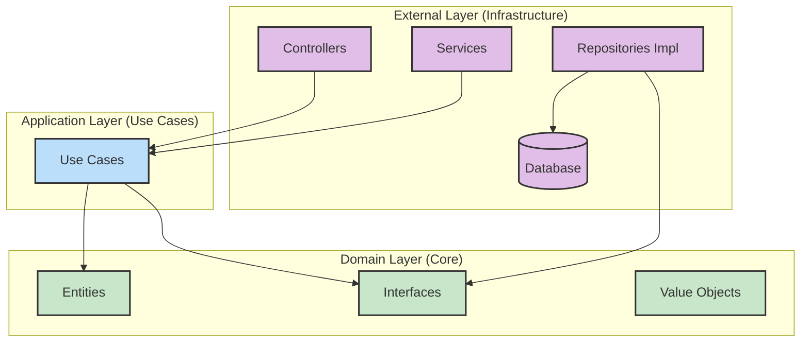
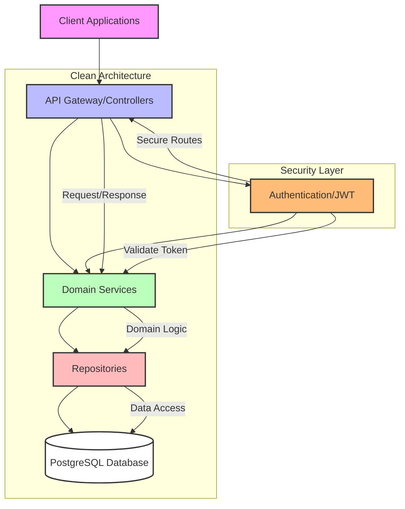
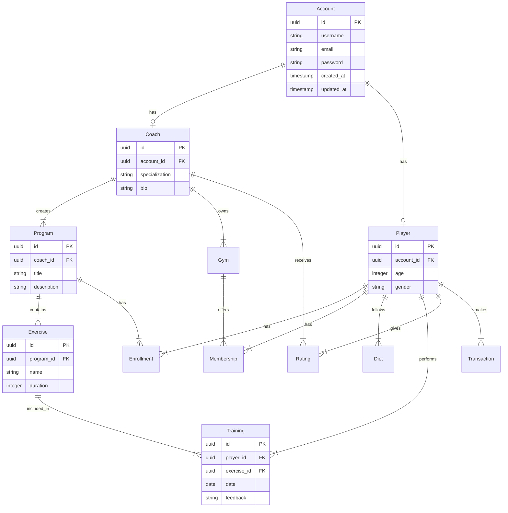

# NestJS Clean Architecture Demo 🏗️

[](https://opensource.org/licenses/MIT)
[](https://nestjs.com/)
[](https://www.typescriptlang.org/)
[](https://www.docker.com/)

A production-ready backend application demonstrating Clean Architecture principles in NestJS. This project showcases how to build scalable, maintainable, and testable applications using Domain-Driven Design (DDD) and SOLID principles.

<p align="center">
  
</p>

## 🎯 Project Overview

This project implements a coaching platform backend that demonstrates:

- **Clean Architecture** implementation in NestJS
- **Domain-Driven Design** (DDD) principles
- **SOLID** principles application
- **Enterprise-grade** project structure
- **Production-ready** configurations
- **Docker** containerization
- **Comprehensive testing** setup

## 🌟 Key Features

### Architecture & Design
- Clean Architecture with clear separation of concerns
- Domain-driven design with rich domain models
- Use-case driven development
- Repository pattern implementation
- SOLID principles adherence

### Technical Implementation
- Advanced authentication & authorization (JWT)
- Comprehensive error handling
- Environment-based configurations
- Swagger API documentation
- Database migrations
- Logging & monitoring setup

### Core Domain Features
- Comprehensive user management (Coaches, Players)
- Program & Training management
- Diet & Exercise tracking
- Membership & Enrollment system
- Rating & Feedback system
- Media handling
- Transaction processing

## System Architecture

### Clean Architecture Layers



### System Architecture Overview



### Database Entity Relationship Diagram



### Code Structure Example

```typescript
// Domain Layer - Entity
// src/domain/entities/coach.entity.ts
export class Coach {
    private readonly id: string;
    private readonly specialization: string;
    private readonly bio: string;

    constructor(props: CoachProps) {
        this.id = props.id;
        this.specialization = props.specialization;
        this.bio = props.bio;
    }

    // Domain logic and business rules
    canCreateProgram(): boolean {
        // Business validation
        return true;
    }
}

// Application Layer - Use Case
// src/use-cases/coach.usecases.ts
export class CreateCoachUseCase {
    constructor(
        private readonly coachRepository: ICoachRepository,
    ) {}

    async execute(data: CreateCoachDto): Promise<Coach> {
        const coach = new Coach(data);
        return this.coachRepository.save(coach);
    }
}

// Infrastructure Layer - Controller
// src/infrastructure/controllers/coach.controller.ts
@Controller('coaches')
export class CoachController {
    constructor(
        private readonly createCoachUseCase: CreateCoachUseCase,
    ) {}

    @Post()
    async createCoach(@Body() data: CreateCoachDto) {
        return this.createCoachUseCase.execute(data);
    }
}
```


## 🛠️ Technology Stack

### Core
- **[NestJS](https://nestjs.com/)** - Progressive Node.js framework
- **[TypeScript](https://www.typescriptlang.org/)** - Static typing and ECMAScript features
- **[PostgreSQL](https://www.postgresql.org/)** - Primary database

### Infrastructure
- **[Docker](https://www.docker.com/)** - Containerization
- **[Docker Compose](https://docs.docker.com/compose/)** - Multi-container orchestration

### Security
- **[JWT](https://jwt.io/)** - Authentication & Authorization
- **[bcrypt](https://github.com/kelektiv/node.bcrypt.js)** - Password hashing

### Development & Testing
- **[Jest](https://jestjs.io/)** - Testing framework
- **[ESLint](https://eslint.org/)** - Code quality
- **[Prettier](https://prettier.io/)** - Code formatting

## 📦 Prerequisites

Before you begin, ensure you have the following installed:
- Node.js (v16 or higher)
- npm (v7 or higher) or Yarn
- Docker & Docker Compose
- PostgreSQL (if running locally)

## 🚀 Getting Started

### Local Development Setup

1. Install dependencies:
   ```bash
   yarn install
   # or
   npm install
   ```
2. Configure environment variables in `env/local.env`.
3. Start the server:
   ```bash
   yarn start:dev
   # or
   npm run start:dev
   ```

### Docker Setup

1. Copy and edit environment variables in `env/local.env` as needed.
2. Build and start containers:
   ```bash
   docker-compose up --build
   ```

### Running Tests

```bash
yarn test:e2e
# or
npm run test:e2e
```

## 📁 Project Structure

The project follows Clean Architecture principles with a clear separation of concerns:

```
src/
├── domain/                 # Enterprise business rules
│   ├── entities/          # Enterprise business entities
│   ├── repositories/      # Repository interfaces
│   ├── adapters/         # Interface adapters
│   └── models/           # Domain models & value objects
├── infrastructure/        # Frameworks & tools
│   ├── common/           # Shared utilities
│   ├── config/           # Configuration
│   ├── controllers/      # REST API controllers
│   ├── repositories/     # Repository implementations
│   └── services/         # External service implementations
├── use-cases/            # Application business rules
├── app.module.ts         # Main application module
└── main.ts              # Application entry point
```

## ⚙️ Environment Configuration

Configure your environment in `env/local.env`:

```bash
# Database Configuration
DB_HOST=localhost
DB_PORT=5432
DB_USER=youruser
DB_PASS=yourpass
DB_NAME=mycoach

# JWT Configuration
JWT_SECRET=your_jwt_secret
JWT_EXPIRATION=3600

# Server Configuration
PORT=3000
NODE_ENV=development
```

## 📚 API Documentation

The API documentation is available through Swagger UI at `/api/docs` when running the application. The endpoints are organized by domain entities:

- `/api/v1/accounts` - Account management
- `/api/v1/coaches` - Coach profiles and management
- `/api/v1/players` - Player profiles and management
- `/api/v1/programs` - Training programs
- `/api/v1/memberships` - Membership management
- `/api/v1/enrollments` - Program enrollments
- `/api/v1/diets` - Diet plans
- `/api/v1/exercises` - Exercise library
- `/api/v1/trainings` - Training sessions

## 🤝 Contributing

Contributions are welcome! Please feel free to submit a Pull Request.

## 📝 License

This project is licensed under the MIT License - see the [LICENSE](LICENSE) file for details.

## 🙋‍♂️ Author

Created by [Yazan Zebak](https://github.com/YazanZebak)
